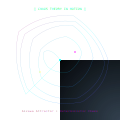

<!-- Aizawa Chaos System Animation -->

# 🌊 Shivansh - Chaos Engineer 🌊

*"In chaos, there is beauty. In complexity, there is simplicity."*

### 🔬 Exploring the Mathematics of Chaos

Aizawa System: dx/dt = (z-b)x - dy
dy/dt = dx + (z-b)y
dz/dt = c + az - z³/3 - (x²+y²)(1+ez) + fz(x³)

text

**🎯 Building systems that dance on the edge of chaos**

